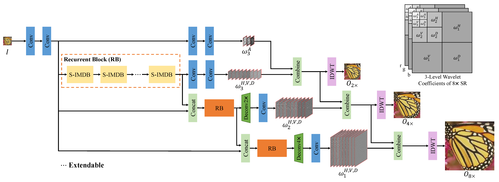
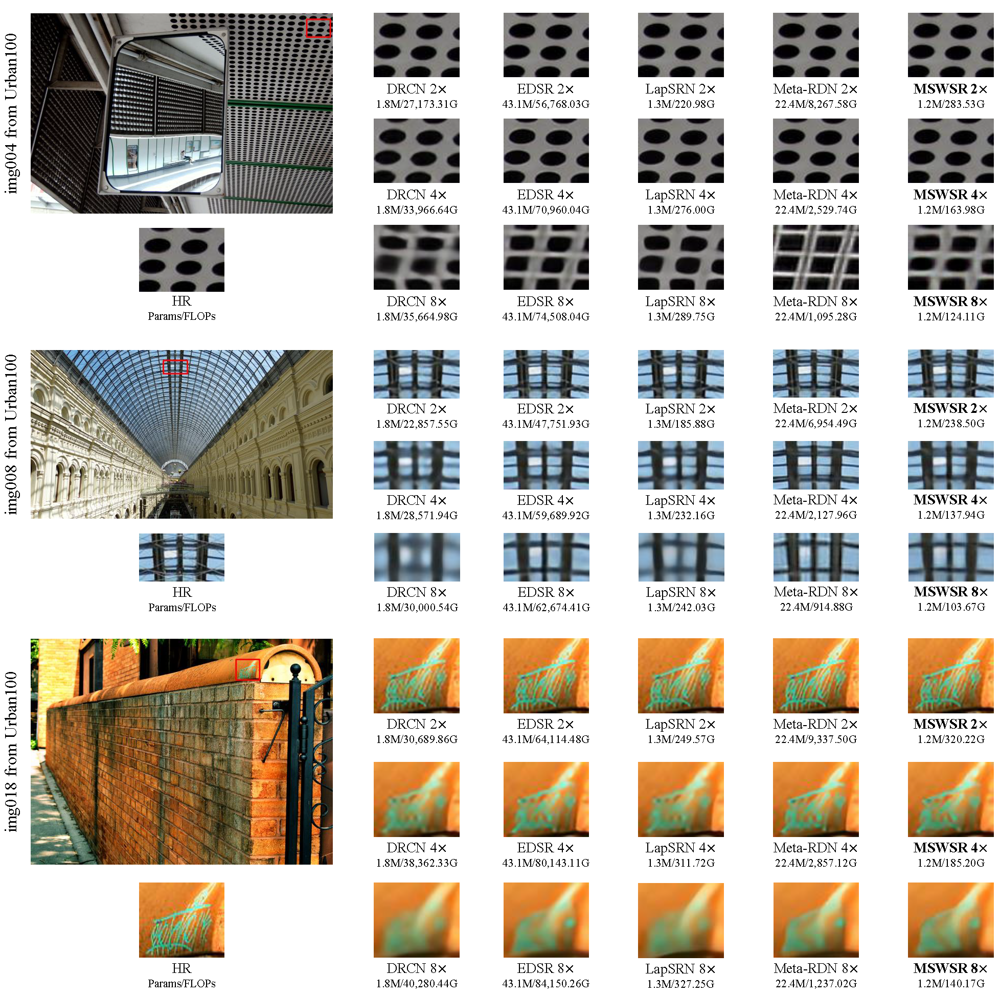

# Multi-scale Image Super-Resolution via A Single Extendable Deep Network (accepted by JSTSP)

This repository is the official PyTorch implementation for our proposed MSWSR.
The code is developed by [supercaoO (Huanrong Zhang)](https://github.com/supercaoO) based on [WSR](https://github.com/supercaoO/WSR).
In the future, the update will be released in [supercaoO/MSWSR](https://github.com/supercaoO/MSWSR) first.

## Introduction

We propose a lightweight and fast network (MSWSR) to implement multi-scale SR simultaneously by learning multi-level wavelet coefficients of the target image. The proposed network is composed of one CNN part and one RNN part. The CNN part is used for predicting the highest-level low-frequency wavelet coefficients, while the RNN part is used for predicting the rest frequency bands of wavelet coefficients. Moreover, the RNN part is extendable to more scales. For further lightweight, a non-square (side window) convolution kernel is proposed to reduce the network parameters.



The framework of the proposed MSWSR for (2, 4, 8)x SR tasks. All of the recurrent blocks (RBs) share the same weights.

The details about the S-IMDB can be found in [our main paper (wait to be released)](https://dl.acm.org/doi/10.1145/3394171.3413664).

If you find our work useful in your research or publications, please consider citing:

```latex
@article{zhang2021mswsr,
    author = {Zhang, Huanrong and Xiao, Jie and Jin, Zhi},
    title = {Multi-scale Image Super-Resolution via A Single Extendable Deep Network},
    journal = {IEEE Journal of Selected Topics in Signal Processing},
    year= {2021}
}
```


## Contents
1. [Requirements](#Requirements)
2. [Test](#test)
3. [Train](#train)
4. [Results](#results)
5. [Acknowledgements](#acknowledgements)

## Requirements
- cuda & cudnn
- Python 3
- [PyTorch >= 1.0.0](https://pytorch.org/)
- [pytorch_wavelets](https://github.com/fbcotter/pytorch_wavelets)
- tqdm
- cv2
- pandas
- skimage
- scipy = 1.0.0
- Matlab

## Test

#### Quick start

1. Clone this repository and cd to `MSWSR`:

   ```shell
   git clone https://github.com/supercaoO/MSWSR.git
   cd MSWSR
   ```

2. Check if the pre-trained model `MSWSR_x248.pth` exists in `./models`.

3. Then, run following commands for evaluation on *Set5*:

   ```shell
   CUDA_VISIBLE_DEVICES=0 python test.py -opt options/test/test_MSWSR_Set5_x248.json
   ```

4. Finally, PSNR/SSIM values for *Set5* are shown on your terminal, you can find the reconstruction images in `./results/SR/BI`.

#### Test on standard SR benchmark

1. If you have cloned this repository, you can first download SR benchmark (Set5, Set14, B100, Urban100 and Manga109) from [GoogleDrive](https://drive.google.com/file/d/1fC0AeoCLK8Oo3utnVa3E_r_45sJla4d1/view) (provided by [SRFBN_CVPR19]((https://github.com/Paper99/SRFBN_CVPR19))) or [BaiduYun](https://pan.baidu.com/s/19-RNNv9sr4MDdrWvsR4_4Q) (code: p9pf).

2. Run `./results/Prepare_TestData_HR_LR.m` in Matlab to generate HR/LR images with BI degradation model.

3. Edit `./options/test/test_WSR_x248_BI.json` for your needs according to [`./options/test/README.md`.](./options/test/README.md)

4. Then, run command:
   ```shell
   cd WSR
   CUDA_VISIBLE_DEVICES=0 python test.py -opt options/test/test_WSR_x248_BI.json
   ```

5. Finally, PSNR/SSIM values are shown on your terminal, you can find the reconstruction images in `./results/SR/BI`. You can further evaluate SR results using `./results/Evaluate_PSNR_SSIM.m`.

#### Test on your own images

1. If you have cloned this repository, you can first place your own images to `./results/LR/MyImage`.

2. Edit `./options/test/test_MSWSR_own.json` for your needs according to [`./options/test/README.md`.](./options/test/README.md)

3. Then, run command:
   ```shell
   cd MSWSR
   CUDA_VISIBLE_DEVICES=0 python test.py -opt options/test/test_MSWSR_own.json
   ```

4. Finally, you can find the reconstruction images in `./results/SR/MyImage`.

## Train

1. Download training set DIV2K from [official link](https://data.vision.ee.ethz.ch/cvl/DIV2K/) or [BaiduYun](https://pan.baidu.com/s/1dN5HIFgNKXQHQoe9ypX0jQ) (code: m84q).

2. Run `./scripts/Prepare_TrainData_HR_LR.m` in Matlab to generate HR/LR training pairs with BI degradation model and corresponding scale factor.

3. Run `./results/Prepare_TestData_HR_LR.m` in Matlab to generate HR/LR test images with BI degradation model and corresponding scale factor, and choose one of SR benchmark for evaluation during training.

4. Edit `./options/train/train_WSR_x248.json` for your needs according to [`./options/train/README.md`.](./options/train/README.md)

5. Then, run command:
   ```shell
   cd MSWSR
   CUDA_VISIBLE_DEVICES=0 python train.py -opt options/train/train_WSR_x248.json
   ```

6. You can monitor the training process in `./experiments`.

7. Finally, you can follow the [**Test Instructions**](#test) to evaluate your model.

## Results

The inference time is measured on B100 dataset (100 images) using Intel(R) Xeon(R) Silver 4210 CPU @ 2.20GHz and NVIDIA TITAN RTX GPU. More detailed settings of comparison can be found in our main paper.

#### Quantitative Results


Comparisons on the number of network parameters, FLOPs, inference time, and PSNR/SSIM/LPIPS of different single-scale SR methods. Down arrow: Lower is better. Up arrow: Higher is better. Best and second best results are marked in red and blue, respectively.


Comparisons on the number of network parameters, FLOPs, and inference time of different single-scale SR methods with higher PSNR/SSIM/LPIPS. Down arrow: Lower is better. Up arrow: Higher is better. Best and second best results are marked in red and blue, respectively.


Comparisons on the number of network parameters, FLOPs, inference time, and PSNR/SSIM/LPIPS of different multi-scale SR methods. Down arrow: Lower is better. Up arrow: Higher is better. Best and second best results are marked in red and blue, respectively.

#### Qualitative Results


Visual comparisons of (2, 4, 8)x SR with different SR advances including single-scale SR networks (*i.e.*, DRCN, and EDSR) and multi-scale SR networks (*i.e.*, LapSRN, and Meta-RDN).

## Acknowledgements

- Thank [supercaoO](https://github.com/supercaoO). Our code structure is derived from his repository [WSR](https://github.com/supercaoO/WSR). 
